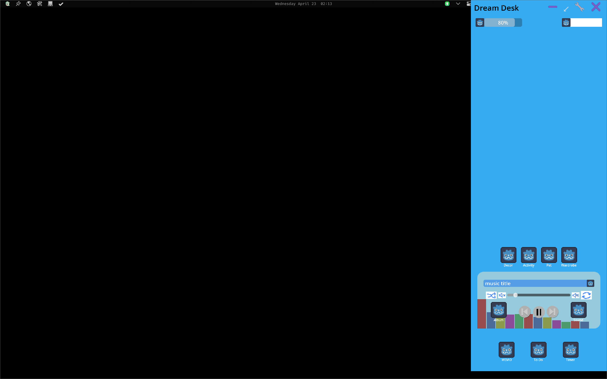

# Dream Desk

Listen to songs while working on you Desktop with out distractions!

# How to contribute

* Check out the design document!
  * https://docs.google.com/document/d/1bxwCIu8dUqzIRJ2AahoE7beGwVXHc7gG6pT22W7q-tk/edit?usp=sharing

* Intall Godot 4.4
  * https://godotengine.org/

* Fork the source code and download it
* Add feature and pull request!
* (or just clone and push commit..? 😅)
  * at least push in a separte branch..!

* Just tell me what features to add!
  * eunhyeoq@gmail.com